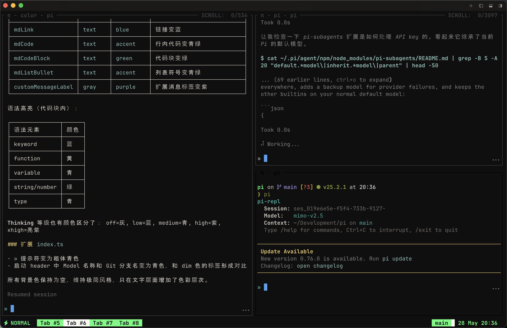

# pi-minimal

Minimalist REPL-style extension for [pi](https://github.com/earendil-works/pi-mono) coding agent.



## Features

### REPL-Style Interface

- **`»` prompt prefix** - Bold cyan prompt replacing the default editor chrome
- **No borders** - Top and bottom `─` lines stripped from the editor
- **Block cursor** - Accent-colored block cursor instead of default reverse-video
- **Hidden footer** - No status bar, no hints, no logo

### Clean Startup

```
pi-repl
  Session: ses_019e6491-7201-7b74-928d-
  Model:   gpt-5.4-mini
  Context: ~/Development/pi on main
  Type /help for commands, Ctrl+C to interrupt, /exit to quit

» _
```

- Session ID, model name, working directory, and git branch at a glance
- `quietStartup` enabled automatically to suppress verbose resource listing

### Compact Message Spacing

Consecutive blank lines in the conversation are compressed to a single blank line, keeping the output dense and readable.

### Minimal Theme with Semantic Colors

All backgrounds and borders are stripped (empty strings), but text retains meaningful color differentiation:

| Element | Color |
|---------|-------|
| Tool titles (`read`, `bash`, `edit`...) | Teal (`accent`) |
| File paths in tool calls | Teal (`accent`) |
| Markdown headings | Yellow |
| Markdown links | Blue |
| Inline code / code blocks | Teal / Green |
| List bullets | Teal |
| User messages | Blue |
| Syntax highlighting | Blue keywords, yellow functions, cyan variables, green strings |
| Thinking levels | Graduated: gray -> blue -> cyan -> purple |

### Auto-Setup

On first run the extension automatically:

1. Copies `minimal.json` to `~/.pi/agent/themes/`
2. Sets `quietStartup: true` in `~/.pi/agent/settings.json`

## Installation

### Copy to extensions directory

```bash
# Global (all projects)
cp -r extensions/ ~/.pi/agent/extensions/pi-minimal/
cp themes/minimal.json ~/.pi/agent/themes/

# Project-local
mkdir -p .pi/extensions .pi/themes
cp -r extensions/ .pi/extensions/pi-minimal/
cp themes/minimal.json .pi/themes/
```

### Via settings.json

Add to `~/.pi/agent/settings.json` or `.pi/settings.json`:

```json
{
  "extensions": ["/path/to/pi-minimal/extensions/index.ts"],
  "themes": ["/path/to/pi-minimal/themes/minimal.json"]
}
```

### One-off: CLI flag

```bash
pi --extension /path/to/pi-minimal/extensions/index.ts
```

## Files

```
pi-minimal/
├── extensions/
│   └── index.ts          # Extension entry point (editor, header, cursor, spacing)
├── themes/
│   └── minimal.json      # Theme definition (no backgrounds, semantic text colors)
├── screenshot.png
├── package.json
└── README.md
```

## Compatibility

- Requires pi v0.75.0 or later
- Uses `CustomEditor` from `@earendil-works/pi-coding-agent`

## License

MIT
